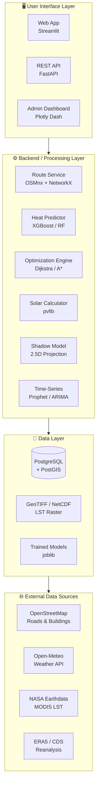

# 🌡️ Heat Exposure Prediction & Route Optimization System

<div align="center">

**نظام ذكي للتنبؤ بالتعرض الحراري وتحسين المسارات الخارجية في البيئات الحارة**

*An intelligent system for predicting heat exposure and optimizing outdoor routes*

[](https://www.python.org/downloads/)
[](https://opensource.org/licenses/MIT)
[](https://fastapi.tiangolo.com/)
[](https://streamlit.io/)

</div>

---

## 📋 Overview

This system helps **delivery workers, cyclists, and scooter riders** make better decisions about outdoor travel in hot climates. Instead of just finding the shortest route, it predicts **cumulative heat exposure** along each route and recommends the optimal combination of **route + departure time** to minimize thermal stress.

### ❓ The Problem

> The fastest route isn't always the safest. A 15-minute shortcut through unshaded asphalt at 1 PM could expose you to more heat stress than a 20-minute route through tree-lined streets.

### ✅ The Solution

The system:
1. **Collects** real-time weather, solar radiation, road surface, and shadow data
2. **Predicts** per-segment heat exposure using ML models
3. **Optimizes** route selection balancing speed vs. thermal comfort
4. **Recommends** the best departure time to minimize exposure
5. **Explains** why a route is recommended using SHAP

### 📊 Example Output

```
Route A: 15 min — ⚠️ High heat exposure (42.5)
Route B: 18 min — ✅ Low heat exposure (25.8) ⭐ RECOMMENDED
Route C: 22 min — ✅ Very low heat exposure (20.1)

➤ Route B recommended.
  Takes 3 extra minutes but reduces heat exposure by 39%.
  45% average shade coverage.

➤ Recommended departure: 16:00
  Heat exposure at 16:00 is 40% lower than at 13:00.
```

---

## 🏗️ System Architecture



---

## 📦 Project Structure

```
├── config/settings.py              # Centralized configuration
├── src/
│   ├── data_ingestion/             # Weather, roads, elevation, LST
│   ├── feature_engineering/        # Solar, shadows, surfaces, heat indices
│   ├── modeling/                   # ML prediction & time series
│   ├── optimization/              # Weighted graph & path finding
│   ├── explainability/            # SHAP, comparisons, recommendations
│   └── api/                       # FastAPI endpoints
├── app/streamlit_app.py           # Interactive web UI
├── tests/                         # Unit tests
└── docs/                          # Architecture & datasets documentation
```

---

## 🚀 Getting Started

### Prerequisites

- Python 3.10 or higher
- Git

### Installation

```bash
# Clone the repository
git clone https://github.com/Fadi-Alharbi/Heat-Exposure-Prediction-Route-Optimization-System-Architecture.git
cd Heat-Exposure-Prediction-Route-Optimization-System-Architecture

# Create virtual environment
python -m venv venv
source venv/bin/activate  # Linux/Mac
# venv\Scripts\activate   # Windows

# Install dependencies
pip install -r requirements.txt
```

### Running the API

```bash
uvicorn src.api.main:app --reload --port 8000
```

Then visit: http://localhost:8000/docs

### Running the Streamlit UI

```bash
streamlit run app/streamlit_app.py --server.port 8501
```

### Running Tests

```bash
pytest tests/ -v
```

---

## 🔧 Key Components

### Data Ingestion
| Component | Source | Data |
|-----------|--------|------|
| Weather Client | Open-Meteo API | Temperature, humidity, wind, radiation |
| OSM Fetcher | OpenStreetMap / OSMnx | Roads, buildings, trees |
| LST Fetcher | MODIS (placeholder) | Land surface temperature |
| Elevation | Open-Meteo Elevation | Terrain height |

### Feature Engineering
| Component | Output |
|-----------|--------|
| Solar Calculator | Sun altitude, azimuth, sunrise/sunset |
| Shadow Estimator | Shade fraction per road segment |
| Surface Classifier | Surface type → thermal properties |
| Heat Index Calculator | Heat Index, WBGT, Apparent Temp |
| Segment Extractor | Fine-grained road segments (50m) |

### ML Models
| Model | Input | Output |
|-------|-------|--------|
| Heat Exposure Model | Weather + surface + shade + solar | Heat exposure score |
| Time Series Model | Hourly weather forecast | Best departure time |

### Optimization
| Algorithm | Purpose |
|-----------|---------|
| Dijkstra / A* | Single-objective shortest path |
| Combined Cost | α × time + β × heat_exposure |
| K-Shortest Paths | Generate route alternatives |
| Multi-Trip | Optimize delivery order & timing |

---

## 📊 Datasets

See [docs/datasets.md](docs/datasets.md) for a complete catalog of data sources:

| # | Dataset | Purpose | Source |
|---|---------|---------|--------|
| 1 | OpenStreetMap | Roads & buildings | OSM |
| 2 | Open-Meteo API | Real-time weather | open-meteo.com |
| 3 | ERA5 (CDS) | Historical weather | ECMWF |
| 4 | MODIS LST | Surface temperature | NASA |
| 5 | GloUTCI-M | Thermal comfort labels | Zenodo |
| 6 | WBGT US Counties | Heat stress validation | Figshare |
| 7 | Weather2K | Time-series training | GitHub |
| 8 | UHI Kaggle | Urban heat island | Kaggle |

---

## ⚠️ Disclaimer

> This system does **NOT** provide medical advice and does **NOT** diagnose heat stroke or thermal illness. Its purpose is to predict the **expected heat exposure during a trip** and help optimize route and timing decisions to **reduce** that exposure while maintaining reasonable travel time.

---

## 📄 License

This project is licensed under the MIT License - see the [LICENSE](LICENSE) file.

---

## 🤝 Contributing

Contributions are welcome! Please open an issue or submit a pull request.

---

<div align="center">

**Built with ❤️ for a cooler commute 🌤️**

</div>
